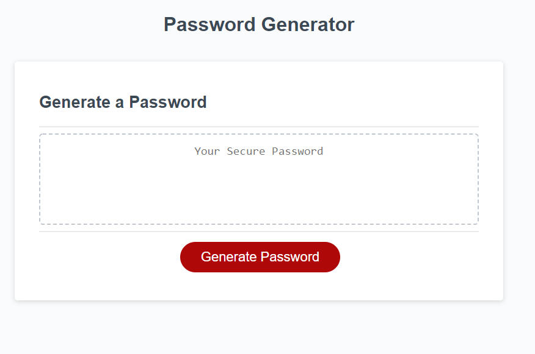

# Password Generator

In this application, you will find a simple password generator. When the Generate Password button is clicked, a window popup appears asking the user to enter the number of characters the password should be (password length). Only numerical values between 8 and 128 would be accepted. If a user enters text, a window popup appears alerting the user of an invalid entry and then asks the user to enter the password length again. Similarly, if a number less than 8 or greater than 128 is entered, another window popup appears alerting the user of an invalid entry. If the user wishes to exit the password generator, pressing cancel would allow for that and a confirmation window appears confirming if the user would like to quit the application.
----
Once a valid password lenght has been entered, a series of confirm windows appear asking the user if they would like to include numbers, uppercase, symbols, or lowercase characters in the password. Pressing OK to each prompt equates to including the character type in the password. After these series of prompts, a visible password is generated in the text area. If the user does not select any character type, then a window aler would appear letting the user know to try again and select at least one character type.
----
Overall, this application demonstrates how javascript and if else statements can be used to provide the user a password output based on the different input the user has selected.
----
----
## [Link to Depolyed Application](https://momaki9.github.io/Password_Generator/)
----
----
## [Link to Code on GitHub](https://github.com/momaki9/Password_Generator)
----
----
## 
----
----
